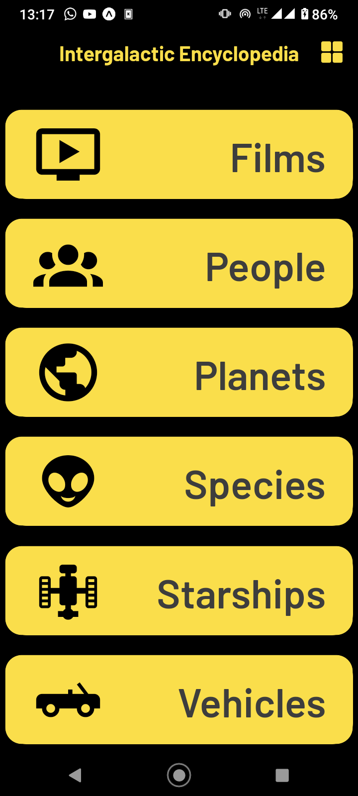
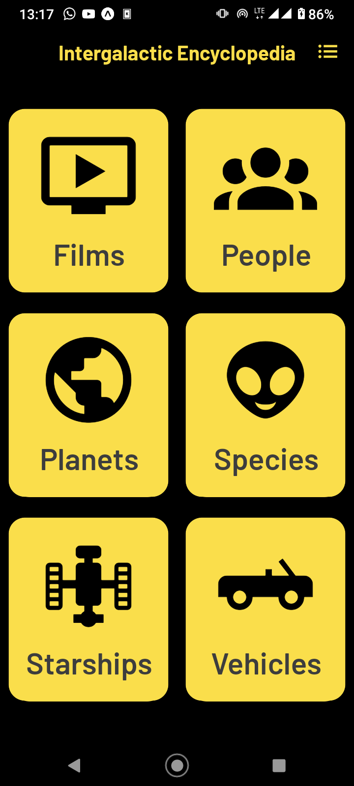

## Introduction

Intergalactic Encyclopedia is your ultimate guide to the Star Wars universe! This comprehensive application provides detailed information on planets, spaceships, vehicles, people, films, and species from a galaxy far, far away. Whether you're a die-hard Star Wars fan or just starting to explore the franchise, Intergalactic Encyclopedia has everything you need to expand your knowledge and dive deeper into this iconic universe. Start exploring today and may the Force be with you!

## Built With

- [React v18.2](https://react.dev/)
- [React Native v0.72](https://reactnative.dev/)
- [Expo SDK v49](https://expo.dev)
- [Typescript v5.1](https://www.typescriptlang.org/)
- [Expo Router v2](https://expo.github.io/router/docs/)
- [React Native Safe Area Context v4.6](https://github.com/th3rdwave/react-native-safe-area-context#readme)
- [Expo Fonts v11.4](https://docs.expo.dev/versions/latest/sdk/font/)
- [Expo Google Fonts v0.2](https://docs.expo.dev/guides/using-custom-fonts/#using-a-google-font) ([Barlow](https://fonts.google.com/specimen/Barlow))

## Screenshots

